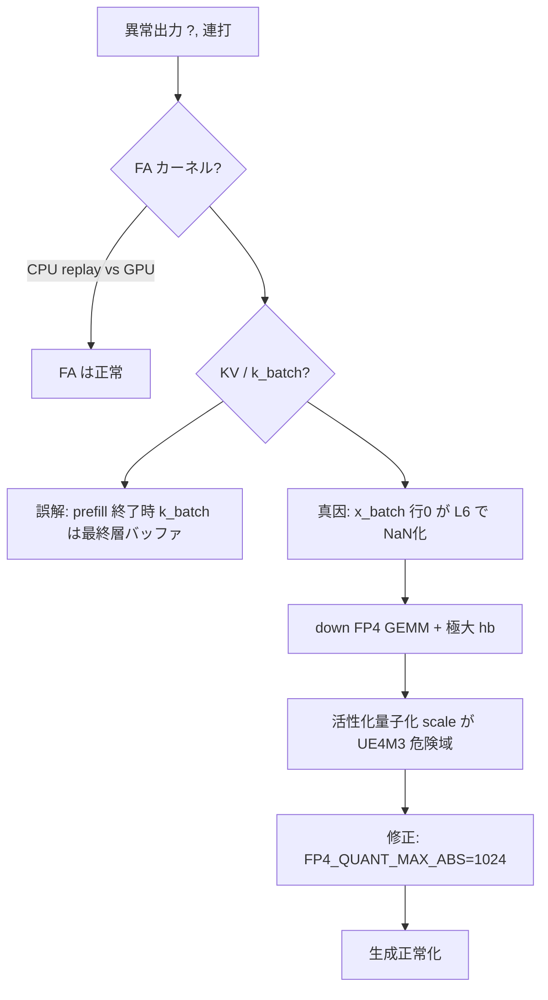

# Qwen3 NVFP4 推論異常 — 調査・修正ログ

本ドキュメントは、`qwen3-gpu-cuda-nvfp4`（Bonsai 系 NVFP4 Tensor Core 経路）で観測された
**異常生成出力**（`.,.,.` / `?,` 連打など）を切り分け・修正した作業の記録である。
会話・エージェントセッション（2026-05 頃）で実施した調査を可能な限り詳細にまとめる。

### 作業開始時点のベースライン

本チャットでの調査・修正は、次のコミットを起点として行った（この時点の tree 上で症状を再現し、以降の差分が本ドキュメントの対象）。

| 項目 | 値 |
|------|-----|
| **ベースコミット** | `433319eb31c3c992536afb5c9a3717084ea5d137` |
| **短縮** | `433319eb` |
| **確認例** | `git show 433319eb31c3c992536afb5c9a3717084ea5d137` / `git diff 433319eb..HEAD -- qwen3-8b/gpu-cuda-nvfp4 qwen3-8b/gpu-cuda` |

以降の章で触れる「修正前」「初期症状」は、特に断りがない限り **このコミット以降・修正適用前** の挙動を指す。

---

## 1. 症状と環境

### 1.1 報告されていた症状

| 条件 | 現象 |
|------|------|
| 短い prefill（例: `"Hello"` ≈20 tok）+ NVFP4 decode 累積 | `gen≥11` 付近から `?,` 等の異常トークン連打 |
| 長いプロンプト（≈52 tok 以上） | 比較的正常な出力になることもある |
| FP16 経路（`gpu-cuda`） | 同条件で正常 |

### 1.2 実行環境（調査時）

- GPU: NVIDIA GeForce RTX 5090（compute **12.0** / Blackwell **sm_120a**）
- モデル: `Qwen_Qwen3-VL-8B-Instruct-IQ2_M.gguf`
- バックエンド: `gpu-cuda-nvfp4`（`BONSAI_FP4` + CUTLASS NVFP4 GEMM）
- FA タイル: `FA_BR=64`（Blackwell Makefile）、`FA_BR=32`（汎用 CUDA Makefile の例あり）

### 1.3 正常系との対比（修正後）

| プロンプト | 例 |
|------------|-----|
| `"Hello"` | `Hi! How can I assist you today?`（NVFP4・修正後） |
| 長ベンチプロンプト | 短文で EOS（後述） |

---

## 2. 調査の全体像（結論ファースト）



**結論（最重要）**

1. **Flash Attention カーネル自体は疑わしくない**（FP16/NVFP4 とも CPU 再現と一致）。
2. **SFA/SFB 索引**（`compute_sf_index`）はホスト検証で CUTLASS layout と一致。
3. **単体 `fp4-test`**（GEMM 経路一致）は PASS。
4. 実推論の主因は **FFN `down` への極大活性化** → **NVFP4 活性化スケール量子化** → **NaN** → **`x_batch[t=0]` 汚染** → **中間層以降 KV の `kc[t=0]=0`** → decode 時 FA が壊れた KV を参照。

---

## 3. 実施した検証（時系列）

### 3.1 SFA 索引検証（先行タスク）

- **追加**: `sfa_index_verify.cpp` + `make sfa-verify`
- **内容**: `compute_sf_index` と CuTe `layout_SFA` / `layout_SFB` の一致
- **結果**: 全ケース **INDEX_OK**（`M_dummy=128` と `256` の SFB 比較含む）
- **所見**: 旧コメント「K>256 で wrong」は**現行式では再現せず**

### 3.2 `fp4-test` 拡張

| ターゲット | 内容 |
|-----------|------|
| `make fp4-test` | cached / gpu-quant / host-layout 3 経路一致 |
| リンク修正 | `fp4_cache_io.o` 追加、`fp4_gemm_prealloc` を verify 内で呼ぶ |
| ホスト量子化 | `1.953125e-3f` 下限・`host_float_to_ue4m3` で GPU と統一 |
| **追加** `run_batch_row_parity` | `M_act=20`, `M_pad=128` でバッチ行 vs 単行行0 一致 |
| **追加** `run_extreme_act` | 活性 `peak≈4857`（`down` 相当 K=12288）で NaN 再現 |

**バッチ行パリティ（重要）**

- `wk_M20` (1024×4096), `down_M20` (4096×12288): **fail_rows=0**  
→ **M=20, M_pad=128 のバッチ GEMM 行インデックス自体は合成データでは正常**。

**極大活性化（決定的）**

- `peak≥2048` 付近から CUTLASS 出力が **NaN**
- 原因: `scale_val = max_abs/6` が大きいと UE4M3 エンコーダが **`ue4m3_exp>=15` → 0x7F** 等の危険なスケールになり、GEMM が NaN を出す（後述 §5）

### 3.3 Flash Attention 診断（`--fa-debug`）

#### 追加ファイル

- `../gpu-cuda/fa_debug.h`
- `../gpu-cuda/fa_debug.c`
- `kernels.cu` 内フック、`main.c` の `--fa-debug` / バックエンドラベル `FP16` / `NVFP4`
- Makefile: `fa_debug.o`, `make fa-debug`, `-DFA_BR=$(FA_BR)`

#### 使い方

```bash
# NVFP4
cd qwen3-8b/gpu-cuda-nvfp4
make fa-debug

# 手動
./qwen3-gpu-cuda-nvfp4 ../Qwen_....gguf -p "Hello" -n 12 -t 0 -s 42 --fa-debug 2>&1 | grep -E '^FA_DEBUG|^    '
```

#### 監視対象

| 種別 | 内容 |
|------|------|
| decode | `pos` 27–34、層 0 / 17 / 35 |
| decode | `kc[t=…]`, `vc[t=…]`, `FA_replay head0`（層0のみ） |
| prefill | 層0 `kv_write` 直後の `kc` |
| prefill 完了 | **全層の `kc` スライス**（L0, L17, L35）— `k_batch` ではない |
| prefill | L0/L17 の `pre-wk` / `post-wk`（`xb`, `k_wk` 行別） |
| prefill | `x_batch[t=0]` 層ごと（L0–L7, L16, L17） |
| prefill L6 | `post-attn`, `pre-down`/`hb`, `down-out`, 層終了時 |

#### FA 診断の主要結果

| 観測 | FP16 | NVFP4（修正前） |
|------|------|-----------------|
| `FA_replay` vs GPU `xb` | `max\|cpu-gpu\|≈1e-8` | 同様に一致 |
| prefill 後 L0 `kc[t=0]` | 正常 | **正常**（wk 直後・kv_write 後） |
| prefill 後 **L17 `kc[t=0]`** | 正常 | **ゼロ** |
| decode L0 `kc[t=0]` | 正常 | 正常 |
| decode L17 `kc[t=0]` | 正常 | **ゼロ** |

→ **FA 入力（KV）が中間層で壊れている。FA カーネルが壊しているわけではない。**

#### 誤解しやすかったポイント（prefill 終了時 `k_batch[t=0]==0`）

初期の `fa_debug_prefill_hook` は **prefill 全層終了後の `k_batch`** をダンプしていた。

- これは **最終層（L35）の wk 出力バッファ**であり、L0 の KV ではない。
- NVFP4 では最終層の batch 行0 がゼロでも、**L0 の `kc[t=0]` は正常**な場合がある。
- 以降のフックは **`gm->kc` / `gm->vc` の layer offset** を正しく参照するよう修正。

---

## 4. 真因の層別トレース（NVFP4, Hello prefill）

### 4.1 `x_batch[t=0]` の層推移

| 層終了後 | `x[t=0]` |
|----------|----------|
| L0–L5 | 有限・増加（max 数十） |
| **L6 `down-out` 直後** | **全要素 NaN**（`nan=4096`） |
| L7+ | NaN のまま |

### 4.2 層6 サブステップ（L6）

| ステップ | `x[t=0]` / `hb` |
|----------|-----------------|
| `post-attn` | 正常（max ≈ 30） |
| `hb[t=0] pre-down` | **max ≈ 4857**（行10/19 は O(1)） |
| `down-out`（`xb_batch`） | **NaN** |

→ **SwiGLU 後の `hb` が行0だけ爆発** → **`down` FP4 GEMM** が NaN 出力 → residual 加算で `x_batch` 汚染。

### 4.3 バッチ GEMM 行0 バグではない理由

- `fp4-test` の `run_batch_row_parity` で M_act=20 は **PASS**。
- 壊れているのは **推論中の実数値分布**（特に L6 の `hb`）と **量子化スケール上限** の組み合わせ。
- 一度検討した **`n_tokens<128` で per-token `M=1` FP4 ループ**は、内部でも `M_pad=128` GEMM のため L6 NaN 問題は解消せず。かつ誤って **FP16 重みを `uint16_t*` として読むフォールバック**は illegal access の原因になった（**採用しない**）。

---

## 5. 修正内容（本番コード）

### 5.1 活性化 `max_abs` キャップ（本修正）

**ファイル**: `fp4_gemm.cu`

```c
static constexpr float FP4_QUANT_MAX_ABS = 1024.0f;
```

`quantize_bf16_to_fp4_kernel` および host 側量子化ループで:

```c
max_abs = fminf(max_abs, FP4_QUANT_MAX_ABS);
```

**理由（技術詳細）**

- ブロックスケール: `scale_val = max_abs / 6` を UE4M3 にエンコード。
- `max_abs=2048` → `scale≈341` → `fp32_exp` により **`ue4m3_exp>=15`** → デバイス側 `d_float_to_ue4m3` は `0x7F` 等に飽和。
- このスケールで CUTLASS NVFP4 GEMM が **NaN** を返すことを `run_extreme_act` で確認（`peak=1024` 以下では PASS、`2048` で FAIL）。
- `1024` は経験的に **`peak=1024` @ 128×128 で PASS** する上限。

### 5.2 `fp4_qwen3.cu`

- GEMM 前に `g_out_bf16` を **`cudaMemset` ゼロクリア**（未初期化出力の疑いを排除。極大活性化の主修正ではない）。

### 5.3 `fp4_verify.cu`

- `run_batch_row_parity`, `run_extreme_act` を追加（回帰用）。

### 5.4 `gpu-cuda/kernels.cu`（診断のみ・本番経路）

- `fa_debug_*` フック多数（§3.3）。
- `gpu_mm_batch`: 最終的に **通常の `fp4_qwen3_mm` バッチ** に戻す（per-token 回避策は不採用）。

### 5.5 触っていない／別問題

- Flash Attention カーネルの `kbase = kc + kvh*hd` 等の GQA レイアウトは、FP16 で FA replay が合っているため **今回の主因ではない**。
- PolarQuant 経路は本調査の主対象外（`#ifdef BONSAI_POLARQUANT` 無効ビルド）。

---

## 6. ベンチマーク・`make log.push`・シード／温度

### 6.1 Makefile 変数（`gpu-cuda-nvfp4/Makefile`）

| 変数 | 典型値 | 意味 |
|------|--------|------|
| `BENCH_PROMPT` | 長い AI 解説文（ChatML で ≈132 tok） |
| `BENCH_N` | 128（最大**生成**トークン） |
| `BENCH_TEMP` | 0 / 0.8 等（**実行行で `$(BENCH_TEMP)` を渡すこと**） |
| `BENCH_SEED` | 42 等 |
| `BENCH_LOG_FILE` | `/tmp/benchmark.log` |

**注意（過去のバグ）**

- 一時期 `echo` では `$(BENCH_TEMP)` 表示なのに、実行が **`-t 0` 固定**だった。
- 現在は `log.push` 実行行が `-t $(BENCH_TEMP) -s $(BENCH_SEED)` であることを確認すること。

### 6.2 生成トークン数が少ない理由（13 など）

- `-n 128` は上限。**EOS/EOT で早期終了**する。
- 長い user 文（質問なしの宣言文）→ assistant が短いメタ文で EOS しやすい。
- **修正前** `gen_tokens=128` のログは、異常時 **`?,` が EOS にならず** `-n` まで走った副作用（意味ある 128 文ではない）。

### 6.3 シード探索（100+ tok 目的）

- `BENCH_TEMP=0.8` で数十シード試行: **最大 gen≈44**（例: seed=1337）。
- **100 超えシードは見つかっていない**（1–500 の線形探索は途中中断）。
- これは「シードが効いていない」というより、**このプロンプト＋モデルではほぼ全経路が早期 EOS** するためと考えられる。
- 100+ tok ベンチが必要なら **プロンプト変更**（質問・続きを書け）、**温度上げ**、またはベンチ専用 EOS 無効化（本番挙動と別）が現実的。

### 6.4 サンプリングの決定性

| 設定 | 挙動 |
|------|------|
| `-t 0` | 貪欲。**シード無関係** |
| `-t 0.8 -s 42` 固定 | **毎回同一出力**（正常） |
| `-t 0.8` + シード変更 | 文が変わる可能性（分布が尖れば変わらないことも） |

---

## 7. 変更ファイル一覧

| パス | 種別 |
|------|------|
| `../gpu-cuda/fa_debug.h` | 新規 |
| `../gpu-cuda/fa_debug.c` | 新規 |
| `../gpu-cuda/kernels.cu` | FA フック、診断 |
| `../gpu-cuda/main.c` | `--fa-debug` |
| `../gpu-cuda/gpu.h` | `gpu_set_prefill_len` 等 |
| `../gpu-cuda/Makefile` | `fa_debug.o`, `fa-debug` |
| `fp4_gemm.cu` | **`FP4_QUANT_MAX_ABS`** |
| `fp4_qwen3.cu` | 出力バッファ memset |
| `fp4_verify.cu` | バッチ行・極大活性テスト |
| `sfa_index_verify.cpp` | SFA 索引検証 |
| `Makefile`（本ディレクトリ） | `fa-debug`, `sfa-verify`, `fp4-test`, `log.push`, `BENCH_*` |

---

## 8. コマンド早見表

```bash
cd qwen3-8b/gpu-cuda-nvfp4

# ビルド・単体テスト
make build
make fp4-test          # GEMM + バッチ行 + 極大活性
make sfa-verify        # SFA 索引

# FA 診断（Hello）
make fa-debug

# 推論
./qwen3-gpu-cuda-nvfp4 ../Qwen_Qwen3-VL-8B-Instruct-IQ2_M.gguf -p "Hello" -n 16 -t 0.8 -s 42

# ベンチ記録
make log.push
make log

# ベンチ上書き例
make log.push BENCH_SEED=77 BENCH_TEMP=0.8 BENCH_N=128
```

---

## 9. 回帰確認チェックリスト

- [ ] `make fp4-test` 全 PASS（`down_extreme` 含む）
- [ ] `make sfa-verify` INDEX_OK
- [ ] `"Hello"` NVFP4: 正常英文（`?,` 連打なし）
- [ ] `--fa-debug`: L17 `kc[t=0]` が非ゼロ（修正後）
- [ ] FP16 vs NVFP4: FA replay 一致
- [ ] `make log.push`: スループット記録が妥当

---

## 10. 今後の検討（未着手）

1. **L6 で `hb[t=0]` だけ爆発する理由**（SwiGLU / gate・up の数値、プロンプト依存）を FP16 と比較。
2. **`FP4_QUANT_MAX_ABS` の理論値**（UE4M3 で `ue4m3_exp<15` となる `max_abs` 上限の厳密化）。
3. **ベンチ用プロンプト**を「128 tok 生成しやすい」指示文に変更（スループット測定の再現性）。
4. **長 prefill + FP4 バッチ** のエンドツーエンドと FP16 の logits 差分（層・トークン単位）。

---

## 11. 用語・データ構造メモ

| 名前 | 意味 |
|------|------|
| `M_act` / `n_tokens` | 実トークン数（例: 20） |
| `M_pad` | `align128(M_act)`（CUTLASS 要件、例: 128） |
| `k_batch` | prefill 時の層内 K バッファ（層ごと上書き） |
| `kc` / `vc` | KV キャッシュ（層 `l`、位置 `t`、サイズ `max_seq × kv_dim`） |
| `FA_BR` | Flash Attention タイル長（共有メモリスコア用） |

---

*最終更新: 本チャット作業内容に基づく。ベースライン: `433319eb31c3c992536afb5c9a3717084ea5d137`。コードはリポジトリの現行 tree を参照して整合を取ること。*
